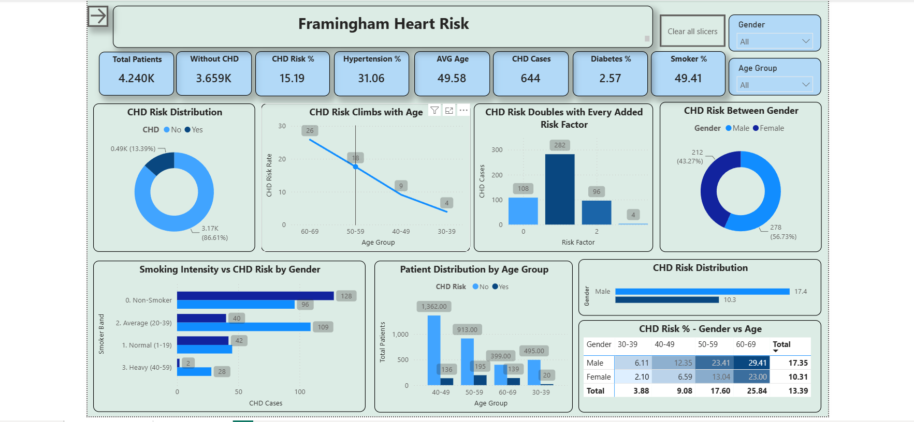
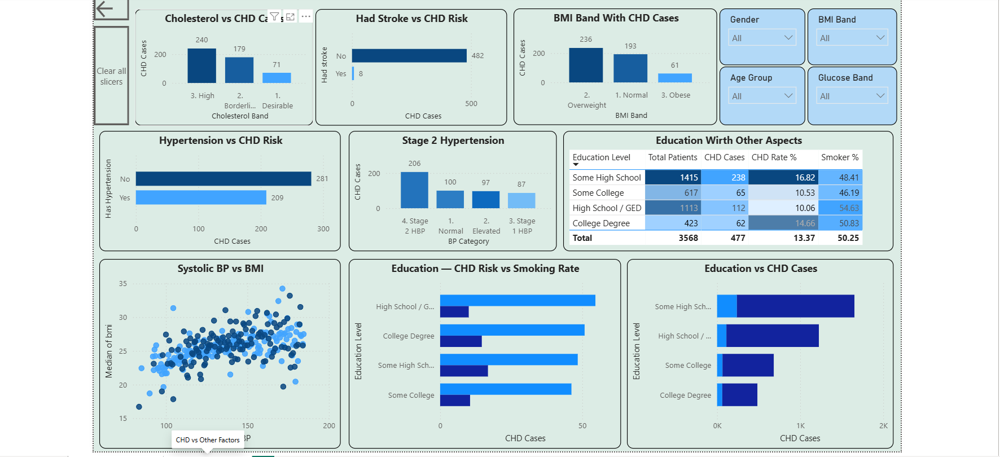

# 🫀 Framingham Heart Disease — Data Analyst Project



> **Objective:** Explore the clinical, demographic, and socioeconomic factors associated with 10-year Coronary Heart Disease (CHD) risk using the Framingham Heart Study dataset from Kaggle.

---

## 📁 Project Structure

```
framingham-heart-disease/
│
├── data/
│   └── framingham_cleaned.csv          # Cleaned dataset (4,240 rows, 17 columns)
│
├── sql/
│   └── framingham_analysis_enhanced.sql  # 21 SQL queries — full analysis
│
├── excel/
│   └── framingham_pivot_analysis.xlsx    # 8 pivot tables + charts
│
├── powerbi/
│   └── framingham_dashboard.pbix         # 2-page interactive Power BI dashboard
│
├── images/
│   ├── chd_risk_overview.png       # Dashboard screenshot — Page 1
│   └── clinical_socioeconomic.png  # Dashboard screenshot — Page 2
│
└── README.md
```

---

## 📊 Dataset Overview

| Property | Value |
|---|---|
| Source | [Kaggle — Framingham Heart Study](https://www.kaggle.com/datasets/aasheesh200/framingham-heart-study-dataset) |
| Total rows | 4,240 |
| Clean rows (outliers excluded) | 3,659 |
| Outlier rows flagged | 581 |
| Columns | 17 |
| Age range | 32 – 70 years |
| Target variable | `chd_risk_10yr` (Yes / No) |

### Columns

| Column | Type | Description |
|---|---|---|
| `gender` | Categorical | Male / Female |
| `age` | Numeric | Age in years |
| `education_level` | Categorical | Some High School / High School GED / Some College / College Degree |
| `is_smoker` | Categorical | Yes / No |
| `cigarettes_per_day` | Numeric | Average daily cigarettes |
| `on_bp_medication` | Categorical | Yes / No |
| `had_stroke` | Categorical | Yes / No |
| `has_hypertension` | Categorical | Yes / No |
| `has_diabetes` | Categorical | Yes / No |
| `total_cholesterol` | Numeric | mg/dL |
| `systolic_bp` | Numeric | mmHg |
| `diastolic_bp` | Numeric | mmHg |
| `bmi` | Numeric | Body Mass Index |
| `heart_rate` | Numeric | Beats per minute |
| `glucose_level` | Numeric | mg/dL |
| `chd_risk_10yr` | Categorical | 10-year CHD risk — Yes / No (target) |
| `has_outlier_flag` | Boolean | True = outlier row, excluded from analysis |

---

## 🔑 Key Findings

### 1. Age is the Strongest Demographic Driver
CHD risk climbs sharply with age:

| Age Group | CHD Risk % |
|---|---|
| 30–39 | 3.88% |
| 40–49 | 9.08% |
| 50–59 | 17.60% |
| 60–69 | 25.84% |

### 2. Gender Gap is Significant
- **Male:** 17.35% CHD risk
- **Female:** 10.31% CHD risk
- Male patients aged 60–69 carry the highest risk at **29.41%**

### 3. Risk Factors Stack Multiplicatively
Combining multiple risk factors dramatically increases CHD risk:

| Risk Factors Combined | CHD Risk % |
|---|---|
| 0 factors | 8.54% |
| 1 factor | 14.41% |
| 2 factors | 22.38% |
| 3 factors | 44.44% |

> Patients with 3 combined risk factors (smoking + hypertension + diabetes + stroke) are **5× more likely** to develop CHD than those with none.

### 4. Stroke History is the Strongest Single Risk Factor
- Had stroke: **44.44% CHD risk**
- No stroke: **13.24% CHD risk**

### 5. Hypertension Doubles CHD Risk
- Hypertensive: **21.57%**
- Non-hypertensive: **10.45%**

### 6. Blood Pressure Medication Paradox
Patients on BP medication show **higher** CHD risk (25.97%) than hypertensive patients not on medication (21.19%). This is a selection effect — higher-risk patients are more likely to be prescribed medication.

### 7. Smoking — Male Pattern Clear, Female Pattern Flat
For males, CHD risk climbs clearly with smoking intensity (Non-smoker 15.36% → Heavy 25.00%). For females, the pattern is flat — suggesting smoking alone is not the primary driver for women.

### 8. Education as a Social Determinant
- Some High School: **16.82%** CHD risk
- High School / GED: **10.06%** CHD risk

Lower formal education correlates with higher CHD risk, likely mediated through smoking rates and healthcare access.

---

## 🛠️ Tools Used

| Tool | Purpose |
|---|---|
| **Python (Pandas)** | Data cleaning, outlier detection, feature engineering |
| **PostgreSQL** | SQL analysis — 21 queries across demographic, clinical, and socioeconomic dimensions |
| **Microsoft Excel** | 8 pivot tables with charts for exploratory analysis |
| **Power BI** | 2-page interactive dashboard with DAX measures, slicers, and conditional formatting |

---

## 🗄️ SQL Analysis — Query Index

| # | Query | Key Insight |
|---|---|---|
| 0 | High-level KPIs | Overall summary metrics |
| 1 | Gender distribution | 2,057 Female · 1,602 Male |
| 2 | CHD risk by gender | Male 17.35% vs Female 10.31% |
| 3 | Smoking by gender & age band | CHD-positive patient smoking breakdown |
| 4 | Avg cigarettes by CHD status | Smoking intensity comparison |
| 5 | Avg age by CHD status | CHD group avg age 53 vs non-CHD 49 |
| 6 | Age group CHD trend | 3.88% → 9.08% → 17.60% → 25.84% |
| 7 | Smoking status vs CHD | Smoker vs non-smoker CHD rate |
| 8 | Smoking band vs CHD by gender | Custom 4-band intensity analysis |
| 9 | Diabetes vs CHD | 15.79% vs 13.38% |
| 10 | Hypertension vs CHD | 21.57% vs 10.45% |
| 11 | BP medication effectiveness | Paradox finding — meds group higher CHD |
| 12 | Stroke history vs CHD | 44.44% vs 13.24% — strongest factor |
| 13 | BMI category vs CHD | Normal 11.04% → Obese 16.67% |
| 14 | Clinical metrics by CHD status | Systolic BP is biggest differentiator (+9.2) |
| 15 | Education level vs CHD | Some High School highest at 16.82% |
| 16 | Multi risk factor stacking | 8.54% → 44.44% across 0–3 factors |
| 17 | Cholesterol bands vs CHD | Desirable 9.66% → High 15.36% |
| 18 | BP category vs CHD (JNC-8) | Normal 8.29% → Stage 2 HBP 21.99% |
| 19 | Glucose bands vs CHD | Normal vs pre-diabetic comparison |
| 20 | Heart rate bands vs CHD | Minimal difference across bands |
| 21 | Gender × age group matrix | Full heatmap data |

---

## 📈 Power BI Dashboard

### Page 1 — 🫀 CHD Risk Overview


- 7 KPI cards (Total Patients, CHD Cases, CHD Rate %, Avg Age, Hypertension %, Smoker %, Avg BMI)
- CHD Risk Distribution donut chart
- CHD Risk Climbs with Age — line chart
- CHD Risk Doubles with Every Added Risk Factor — column chart
- CHD Risk Between Gender — donut chart
- Smoking Intensity vs CHD Risk by Gender — clustered bar
- Patient Distribution by Age Group — clustered bar
- Gender × Age Group CHD % Matrix — heatmap
- Slicers: Gender · Age Group

### Page 2 — 📊 Clinical & Socioeconomic Factors


- Cholesterol vs CHD — bar chart
- Stroke History vs CHD — bar chart
- BMI Band vs CHD — bar chart
- Hypertension vs CHD — bar chart
- BP Category (JNC-8 Standard) — column chart
- Systolic BP vs BMI — scatter plot
- Education Level vs CHD — bar chart
- Education — CHD Risk vs Smoking Rate — clustered bar
- Education with Other Aspects — detail table
- Slicers: Gender · BMI Band · Age Group · Glucose Band

### DAX Measures Used
```dax
CHD Rate % = DIVIDE([CHD Cases], [Total Patients], 0) * 100
CHD Cases = COUNTROWS(FILTER(framingham_cleaned, framingham_cleaned[chd_risk_10yr] = "Yes"))
Total Patients = COUNTROWS(framingham_cleaned)
Smoker % = DIVIDE(smoker_count, [Total Patients], 0) * 100
Hypertension % = DIVIDE(hypertension_count, [Total Patients], 0) * 100
Avg Age = AVERAGE(framingham_cleaned[age])
Avg BMI = AVERAGE(framingham_cleaned[bmi])
Avg Systolic BP = AVERAGE(framingham_cleaned[systolic_bp])
```

### Calculated Columns Added
```dax
age_group = IF([age]<40,"30-39", IF([age]<50,"40-49", IF([age]<60,"50-59","60-69")))
smoker_band = IF([cigarettes_per_day]=0,"0. Non-Smoker", IF([cigarettes_per_day]<=19,"1. Normal (1-19)", IF([cigarettes_per_day]<=39,"2. Average (20-39)","3. Heavy (40-59)")))
risk_factor_count = IF([is_smoker]="Yes",1,0) + IF([has_hypertension]="Yes",1,0) + IF([has_diabetes]="Yes",1,0) + IF([had_stroke]="Yes",1,0)
bmi_band = IF([bmi]<25,"1. Normal", IF([bmi]<30,"2. Overweight","3. Obese"))
bp_category = IF([systolic_bp]<120,"1. Normal", IF([systolic_bp]<130,"2. Elevated", IF([systolic_bp]<140,"3. Stage 1 HBP","4. Stage 2 HBP")))
cholesterol_band = IF([total_cholesterol]<200,"1. Desirable", IF([total_cholesterol]<240,"2. Borderline","3. High"))
glucose_band = IF([glucose_level]<100,"1. Normal", IF([glucose_level]<126,"2. Pre-diabetic","3. Diabetic Range"))
```

---

## 📋 Excel Pivot Tables

8 pivot tables built from the single cleaned CSV source:

| Pivot | Analysis |
|---|---|
| P1 | CHD Risk by Gender |
| P2 | CHD Risk by Age Group |
| P3 | Smoking Intensity vs CHD by Gender |
| P4a | Hypertension vs CHD |
| P4b | Diabetes vs CHD |
| P4c | Stroke vs CHD |
| P5 | BP Medication Effectiveness |
| P6 | BMI Band vs CHD |
| P7 | Education Level vs CHD |
| P8 | Multi Risk Factor Stacking |

---

## ⚠️ Outlier Handling

581 rows (13.7% of dataset) were flagged as outliers using the IQR method across key clinical columns:

| Metric | Clean Max | Outlier Max |
|---|---|---|
| Systolic BP | 184 mmHg | 295 mmHg |
| Glucose | 104 mg/dL | 394 mg/dL |
| Total Cholesterol | 346 mg/dL | 696 mg/dL |
| BMI | 35.5 | 56.8 |

Outlier rows carry nearly **2× the CHD rate** (26.5% vs 13.4%), skewing population-level analysis. All analytical queries and dashboard visuals use `has_outlier_flag = False`.

---

## 👤 Author

**Nismi.MNA**
Data Analyst Portfolio Project
Dataset: Framingham Heart Study — Kaggle